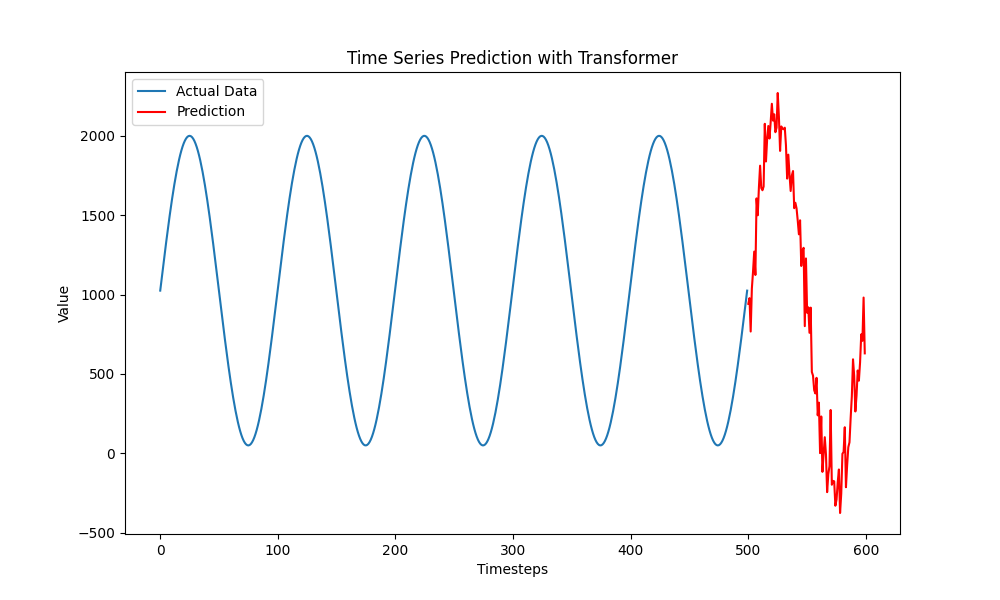

# Streamline

[](LICENSE.md)


[]()

Streamline is a novel dynamic optimization method for data pipeline ensembles that jointly considers throughput, end-to-end latency, and resource utilization while reducing monetary cost. It delivers a holistic optimization approach to ensure efficient processing across an ensemble of data pipelines that integrates the configuration of individual pipeline operators and resource-aware placement of operators.

## Quick Start

### Installation

```bash
# Clone repository
git clone https://github.com/UIBK-DPS-DC/Streamline.git
cd Streamline

# Create and activate virtual environment
python3 -m venv env
source env/bin/activate

# Install dependencies
pip install -r requirements.txt
```

### Examples

> [!TIP]
> We strongly recommend checking the provided examples to enhance understanding of Streamline.

For sample code and implementation guidance, refer to the [examples/](examples) directory. It contains use cases that show how to integrate and use Streamline.

```bash
# Run an example of a single data pipeline
python3.8 examples/single_pipeline.py

# Run an example of an ensembles of data pipelines
python3.8 examples/ensemble.py
```

#### Explanation of the Output for the Ensemble Example

Streamline starts by training the models for the transformers, neural network, and polynomial regression, if they haven't been trained yet.

```bash 
streamline.controller - INFO: Starting Workload Predictor training using Transformers...
streamline.workload_predictor - INFO: Epoch 0/200, Loss: 1.5752
streamline.workload_predictor - INFO: Epoch 100/200, Loss: 0.0169
streamline.workload_predictor - INFO: Epoch 200/200, Loss: 0.0080
streamline.controller - INFO: Starting Neural Network training...
streamline.neural_network - INFO: Epoch 0/200, Train Loss: 0.0946, Val Loss: 0.0582
streamline.neural_network - INFO: Epoch 100/200, Train Loss: 0.0035, Val Loss: 0.0065
streamline.neural_network - INFO: Epoch 200/200, Train Loss: 0.0027, Val Loss: 0.0075
streamline.neural_network - INFO: R^2 Score: Train=0.96, Val=0.90
streamline.controller - INFO: Starting Polynomial Regression training...
```

Once training is complete, Streamline proceeds to predict the workload of operators using the pre-trained transformers and the aspect ratio of operators.

```bash
streamline.controller - INFO: Predicting workload of operators using Transformers and aspect ratio...
```

An example prediction for the source operator `v_0` would be:



Based on the predicted load, NSGA-II is used to determine the configurations for each operator.

```bash
streamline.controller - INFO: Best configuration for v_0: {'parallelism': 3.0, 'segment-size': 16384.0, 'est_tp': 927.0778700111427, 'est_l': 132.9217488861084, 'est_cpu': 1.088749063462019}.
streamline.controller - INFO: Best configuration for v_1: {'parallelism': 2.0, 'segment-size': 16384.0, 'est_tp': 479.0216898107529, 'est_l': 114.85083877563477, 'est_cpu': 0.7306858459115029}.
...
streamline.controller - INFO: Best configuration for v_7: {'parallelism': 5.0, 'segment-size': 16384.0, 'est_tp': 2031.8145743397304, 'est_l': 197.00133499145508, 'est_cpu': 2.8749317958950997}.
```

Finally, the operators are scheduled the resources:

```bash
{'R21': ['v_7_0', 'v_7_1', 'v_7_2', 'v_7_3', 'v_7_4', 'v_6_0', 'v_6_1', 'v_3_0', 'v_3_1', 'v_3_2', 'v_3_3', 'v_1_0', 'v_1_1', 'v_0_0', 'v_0_1', 'v_0_2', 'v_2_0', 'v_2_1', 'v_5_0', 'v_5_1', 'v_5_2', 'v_5_3', 'v_5_4']}
```

## Benchmarks

- ETL, STATS, PRED, and TRAIN can be found [here](https://github.com/DPS-Stream-Processing-Applications/beam-applications-java).
- YSB can be found [here](https://github.com/yahoo/streaming-benchmarks).

## License
This project is licensed under the GPLv3 - see the [LICENSE](LICENSE) file for details.

## Reference

```
TBA
```